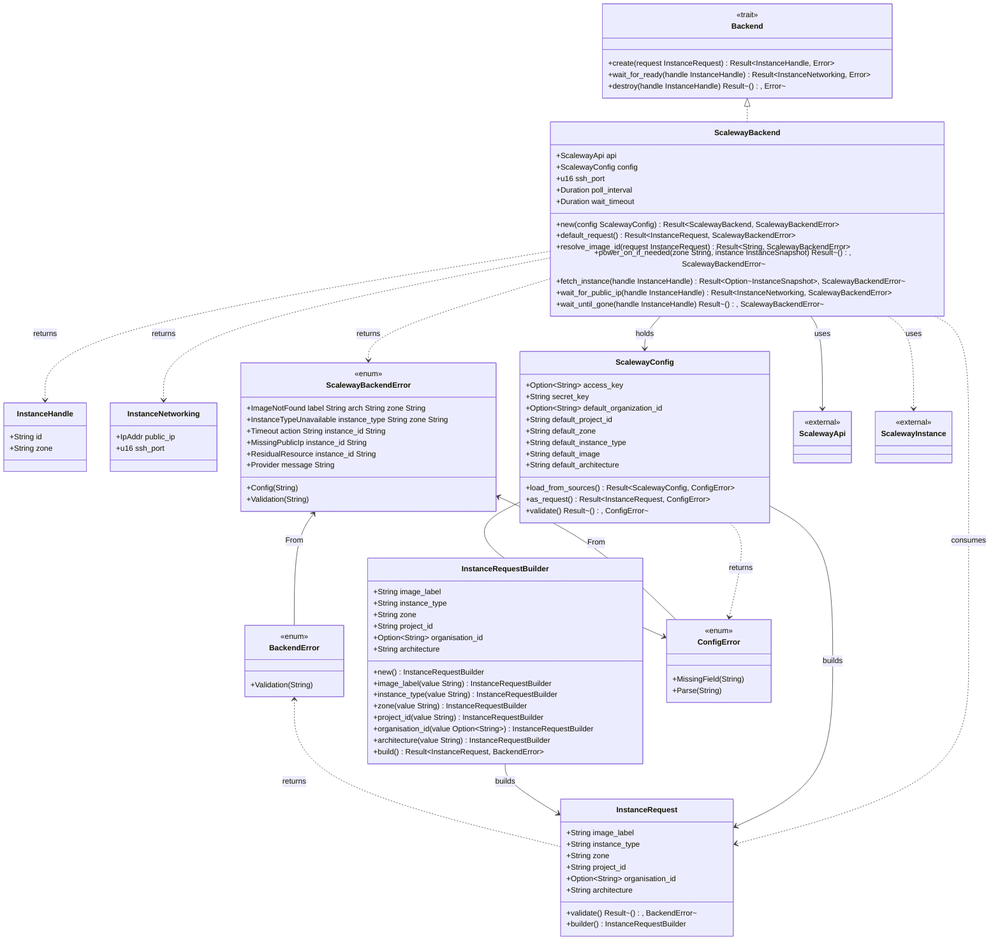

# Technical Design for the Mriya Remote Execution Tool

## Introduction

`mriya` is a command-line tool for offloading heavyweight builds and test
suites to short-lived cloud machines, without forcing you to change how you
work locally.

The core idea is deliberately simple:

> Take the current working directory (minus anything gitignored), “teleport” it
> to a clean remote machine, run a command there, stream the output back, and
> then tear the machine down.

From the user’s perspective this looks like:

```bash
mriya run -- cargo test --workspace --all-features
```

Under the hood, `mriya`:

1. Provisions a new VM on a configured cloud provider.
2. Waits for SSH to become available.
3. Syncs the project tree, respecting `.gitignore`.
4. Executes the given command over SSH.
5. Tears down the VM and returns the remote exit code.

This design targets a couple of concrete pain points:

- **GPU work from non-GPU machines**
  Running CUDA / rust-cuda / rust-gpu workloads from machines like a Mac Studio
  or an ultrabook, by transparently hopping to a remote GPU box for the test
  phase.

- **Large Rust (and friends) test suites in constrained CI/dev environments**
  Offloading builds, tests, and lints for projects like Wildside, mxd, or Lille
  to a beefier ephemeral runner when local or CI runners fall over or thrash.

Rather than building a general-purpose environment manager like Vagrant, or a
clustered hermetic test system like Maelstrom, `mriya` is intentionally
constrained:

- exactly **one VM per run**,
- **ephemeral by default** (VMs never persist across runs),
- a **Git-aware rsync** of the current working tree,
- a single remote command whose exit status becomes `mriya`’s exit status.

Everything else is layered on top of that core:

- persistent volumes for toolchains and caches,
- optional baked images for fast provisioning,
- multiple cloud backends behind a small `Backend` trait,
- a progressive refinement from shelling out to `ssh` to using a native Rust
  SSH client.

This document is written for implementers. It describes:

- the MVP (`v0`) focusing solely on Scaleway, using `scaleway_api_rs`, `git2`,
  rsync, and the system `ssh` client;
- the `Backend` abstraction that will later support Hetzner (`hcloud`),
  DigitalOcean, and AWS;
- the planned evolution through volume support, cloud-init provisioning,
  `mriya init` and `mriya bake-image`, and a `v1.0` with integrated SSH
  (`russh`);
- how toolchain and build performance are optimised using persistent volumes
  and (optionally) `sccache`;
- security and failure-handling concerns around SSH keys, credentials,
  timeouts, and clean teardown.

Each stage is deliberately incremental: every version is a working tool, and
every new feature is justified by what we learned in the previous step.

## MVP (v0) – Scaleway-Only Implementation

The **Minimal Viable Product** of **Mriya** focuses on a single cloud
(Scaleway) and basic functionality. The tool will spin up an ephemeral VM,
synchronize the current project directory (excluding ignored files) to it, run
a user-specified test command, then tear everything down. Key characteristics
of the MVP include:

- **Scaleway VM Lifecycle:** Use the `scaleway_api_rs` crate to create a new
  compute instance (using a base image like Ubuntu), wait for it to become
  SSH-accessible, and destroy it after use. No custom images or attached
  volumes are handled in v0 (the instance’s root disk is ephemeral).

- **Directory Sync (excluding gitignored files):** Leverage `git2` to respect
  the repository’s `.gitignore` rules when selecting files to transfer. For
  efficiency, use the `rsync` CLI with a Git-aware filter to copy files to the
  remote VM. For example, using
  `rsync -az --delete --filter=":- .gitignore" <SRC> <DEST>` will **copy all
  non-ignored files and omit anything listed in
  .gitignore**([1](https://stackoverflow.com/questions/13713101/rsync-exclude-according-to-gitignore-hgignore-svnignore-like-filter-c#:~:text=%60rsync%20,DEST%3E)).
   This approach ensures that build artifacts like `target/` or `node_modules/`
  (which are usually gitignored) are not needlessly uploaded. The `git2`
  library’s ignore functionality (e.g. `Repository::is_path_ignored`) can be
  used to double-check patterns for complex
  cases([2](https://docs.rs/git2/latest/git2/struct.Repository.html#:~:text=,Result%3Cbool%2C%20Error)),
   but the rsync filter is expected to handle most ignore rules.

- **SSH Command Execution:** Once files are synced, Mriya invokes the test
  command on the remote VM via an SSH call. In v0, we use the system `ssh` CLI
  for simplicity. The tool will spawn `ssh user@host "<test_command>"` and
  stream the output back to the user. The remote command’s exit code is
  propagated to Mriya’s own exit code, so that success/failure is transparent
  to whatever invoked Mriya. We will likely enable SSH’s
  `-o StrictHostKeyChecking=no` option for MVP to avoid host key prompts, since
  these VMs are ephemeral (see **Security** below for caveats).

- **VM Teardown:** After command execution, the tool uses the Scaleway API to
  delete the instance. All state on that VM (aside from what was sent back via
  output) is lost. This means subsequent runs start fresh, which simplifies
  cleanup. The workflow is akin to other ephemeral CI systems that **spin up a
  fresh VM with the repo, run tests, then shut it down leaving no
  state**([3](https://docs.charlielabs.ai/how-it-works#:~:text=,devbox%20when%20edits%20are%20needed))([3](https://docs.charlielabs.ai/how-it-works#:~:text=,from%20the%20run%20is%20kept)).

- **Minimal Configuration (`mriya.toml`):** The MVP supports a minimal config
  file to hold settings like cloud credentials and defaults. For example, a
  `mriya.toml` might define a profile for Scaleway:

```toml
[profile.scaleway]
api_token      = "<SCW_API_TOKEN>"
project_id     = "<SCW_PROJECT_ID>"      # Project/Organization to bill the VM
default_zone   = "fr-par-1"              # e.g. Paris zone
default_type   = "DEV1-S"                # Instance type (small dev instance)
default_image  = "ubuntu_focal"          # Base image name or ID
ssh_public_key = "~/.ssh/id_rsa.pub"     # Path to SSH pub key to use on VM
```

In MVP, the **Scaleway API token** (and project or organization ID) are
required to authenticate API calls. We also allow configuration of the default
instance type and image to use for the test VM. The `ssh_public_key` is the key
that will be injected into the VM for SSH access – on Scaleway this can be done
by referencing an SSH key that’s been added to the account or by using
cloud-init user-data (though in v0 we might simply rely on the key being
pre-registered in the Scaleway console). Mriya will read this config to know
how to start the VM. The config format is designed to be extensible for other
providers in future versions (each under its own profile section).

**Rationale:** Focusing on Scaleway and a basic end-to-end flow keeps the
initial implementation manageable. At this stage we validate that we can
programmatically create a cloud instance, copy project files, run a command,
and destroy the instance – essentially **proving the concept of “teleporting” a
working directory to the cloud and executing tests remotely**. We expect to
learn about baseline performance (e.g. how long setup and teardown take) and
identify any pain points (like large file transfer overhead or slow
provisioning) that will guide subsequent optimizations.

### Directory sync decision (December 2025)

- Adopt `rsync -az --delete --filter=":- .gitignore" --exclude .git/` so Git
  ignore rules apply to both transfer and deletion. Ignored caches (for example
  `target/`) are left intact on the remote to enable incremental builds.
- Wrap rsync and SSH execution in a `Syncer` orchestration layer that returns
  the remote command’s exit code unchanged, allowing the CLI to mirror the
  remote status.
- Centralize SSH flags (port, batch mode, host-key checking, known hosts path)
  in `SyncConfig` so environments with stricter host verification can enable it
  without code changes.
- Always execute remote commands from the configured `remote_path` by
  wrapping the SSH invocation with `cd {remote_path} && …`, so callers do not
  need to prepend a directory change manually after syncing.
- Keep sync configuration under the `MRIYA_SYNC_` prefix via `ortho-config` so
  users can override the rsync/ssh binaries, SSH user, and remote path without
  changing code.

### Volume attachment decision (December 2025)

- Implement volume attachment as an optional configuration
  (`SCW_DEFAULT_VOLUME_ID`
  or `default_volume_id` in `mriya.toml`) that attaches a pre-existing Block
  Storage volume to the instance before power-on.
- Use a direct HTTP PATCH call to the Scaleway API for volume attachment since
  the `scaleway-rs` crate v0.1.9 does not expose volume management in its
  instance builder. The request updates the server's volumes map, preserving
  the root volume at index "0" and adding the cache volume at index "1".
- Mount the volume after SSH becomes available using
  `sudo mkdir -p /mriya && sudo mount /dev/vdb /mriya 2>/dev/null || true`. The
  `|| true` ensures graceful degradation if the volume lacks a filesystem or
  mounting fails for other reasons.
- Device path `/dev/vdb` is used because Scaleway assigns block devices
  sequentially: root at `/dev/vda`, first additional volume at `/dev/vdb`.
- Add `volume_mount_path` to `SyncConfig` (default `/mriya`) to allow
  customisation of where the cache volume is mounted.
- Volume ID flows through the configuration layer (`ScalewayConfig`) to
  `InstanceRequest` and is processed during the create flow, before the
  instance is powered on.

### Remote execution flow decision (December 2025)

- Keep the system `ssh` client for MVP and stream stdout/stderr via a
  streaming command runner so local output mirrors the remote console.
- Preserve remote exit codes verbatim in `mriya run`; when SSH reports no
  status (for example, a signal terminates the process), exit with code 1 and
  surface the missing status to the user.
- Load Scaleway and sync configuration via `ortho-config` defaults, config
  files, and environment variables without consuming unrelated CLI flags from
  `mriya run` itself.
- Execute remote commands from the configured `remote_path` so callers do not
  need to prefix `cd` manually.

### Implementation status (November 2025)

- **Backend crate choice:** The MVP backend uses `scaleway-rs` (async, rustls
  TLS) rather than the experimental `scaleway_sdk` because it already exposes
  builders for instance creation, listing, and lifecycle actions needed for the
  create → wait → destroy loop.
- **Configuration:** Credentials and defaults are layered via `ortho-config`
  with the `SCW_*` prefix. The loader honours defaults (zone `fr-par-1`, type
  `DEV1-S`, image label `Ubuntu 24.04 Noble Numbat`, arch `x86_64`) and merges
  files, environment, and CLI flags. Missing `SCW_SECRET_KEY` or project IDs
  fail fast during validation.
- **Lifecycle contract:** Creation resolves the freshest image ID matching the
  requested label and architecture in the target zone, then requests a public
  routed IP so SSH is reachable. Readiness polling runs every 5 seconds with a
  5-minute cap and requires both a public IPv4 and the `running` state.
- **Teardown verification:** Destruction calls the Instances API delete
  endpoint then polls until the server disappears, failing the integration test
  if any residual resource remains. Integration coverage provisions the
  smallest shape (`DEV1-S`) to keep cost and blast radius low.

## Backend Abstraction Design

To support multiple cloud providers in the future, Mriya’s core should be
cloud-agnostic. We introduce a `Backend` abstraction – a Rust trait that
defines the minimal interface for a cloud backend driver. For the MVP, only a
**ScalewayBackend** implementation exists (wired to Scaleway’s API), but the
design anticipates others (Hetzner, DigitalOcean, AWS, etc.) in later versions.

### Class diagram

<!-- markdownlint-disable MD013 -->

<!-- markdownlint-enable MD013 -->

**`Backend` Trait – Minimal Interface:** At v0, the trait can be very simple,
focusing on the VM lifecycle:

```rust
trait Backend {
    fn create_vm(&self, opts: CreateOpts) -> Result<InstanceHandle>;
    fn wait_for_ssh(&self, handle: &InstanceHandle) -> Result<IpAddr>;
    fn destroy_vm(&self, handle: InstanceHandle) -> Result<()>;
}
```

- `create_vm` should provision a new VM instance and return an `InstanceHandle`
  (which might include the instance ID or other metadata like volume IDs, plus
  the chosen SSH login user and possibly an initial public IP).

- `wait_for_ssh` will block until the instance is reachable via SSH on its
  public IP, returning the IP (and possibly ensuring the SSH service is up).
  This could be implemented by polling the instance status via API and/or
  attempting socket connections on port 22.

- `destroy_vm` tears down the instance (deleting it and freeing any allocated
  resources like IPs).

Each backend implementation (Scaleway, Hetzner, etc.) will encapsulate the
provider-specific logic for these steps. For example, Scaleway’s `create_vm`
will call into `scaleway_api_rs` to create a server in a specific zone.
Hetzner’s might call the `hcloud` crate to create a server, DigitalOcean’s
would call their API (via a Rust SDK like the `digitalocean` crate), and AWS
could use the AWS SDK or `rusoto` to launch an EC2 instance. The trait method
signatures can be async (using `tokio`) if needed, since API calls are
network-bound.

**Handling Provider Differences:** While all cloud providers offer similar
primitives (instances, images, volumes, networks), there are important
differences:

- **Authentication & Initialization:** Scaleway requires an API token and
  project ID; AWS uses access keys and requires specifying region, etc. The
  config file’s profile sections will supply the necessary credentials for each
  backend. The `Backend` implementor can handle reading its credentials from
  the profile.

- **Instance Creation Options:** The parameters to create a VM vary. For
  Scaleway, we specify a commercial type (instance size) and an image ID or
  label([4](https://www.scaleway.com/en/developers/api/instances/#:~:text=Scaleway%20Project%20ID%20,Instance%20types%20and%20their%20IDs)).
   For Hetzner, a server type and an image (like an Ubuntu version) must be
  provided. DigitalOcean needs a droplet size, region, and an image slug (e.g.
  "ubuntu-20-04-x64"). AWS’s EC2 requires an AMI ID, instance type,
  subnet/security group, and an SSH key name. Our `CreateOpts` can abstract
  these (e.g. having fields for image, instance_type, region/zone, and an SSH
  key or user-data for keys). The Backend trait may not expose every parameter
  at first; instead it can use sane defaults from config. For example, the
  Scaleway backend might default to using the `default_type` and
  `default_image` from the profile if not overridden.

- **SSH Key Injection:** Each provider has a way to ensure the VM is accessible
  via SSH. Scaleway allows specifying an SSH key that’s already uploaded to the
  account, or one can add an **AUTHORIZED_KEY** tag on the instance with the
  public
  key([5](https://www.scaleway.com/en/docs/instances/reference-content/add-instance-specific-ssh-keys-using-tags/#:~:text=Using%20tags%20to%20add%20Instance,tags%20for%20each%20SSH%20key)).
   DigitalOcean requires specifying the *ID of an SSH key* that’s been added to
  your DO account when creating the droplet. AWS requires a key pair name (the
  key must be pre-created or uploaded in that region). We plan for the profile
  config to include an identifier or name for the SSH key to use per provider,
  and the backend implementations will inject that into the creation request.
  If a provider doesn’t support direct key injection, we could fall back to
  cloud-init user-data to install the key (see v0.2). The `Backend` trait might
  thus accept a prepared user-data script (which could contain the public key)
  as part of `CreateOpts`.

- **Instance Identification & Networking:** After creating an instance, we need
  its IP address for SSH. Some APIs (like AWS) may return the IP only once the
  instance is fully started, others might require an additional call to fetch
  the assigned IP. Our Scaleway implementation will retrieve the public IPv4
  from the create response or by a follow-up API call once the instance status
  is “running”. We ensure the trait returns the IP (or the whole handle
  contains it) so that the core Mriya logic can use it to SSH.

- **Teardown semantics:** Destroying an instance is straightforward on all
  providers, but we must also consider any ancillary resources. For example,
  Scaleway and AWS allocate elastic IPs or volumes that might need cleaning up
  if not automatically removed with the VM. The MVP simply deletes the VM and
  assumes the provider cleans attached resources (Scaleway by default deletes
  the attached root volume with the instance). In the future, our trait might
  need to handle explicit cleanup of things like volumes or floating IPs if
  they were allocated separately.

**Evolving the Trait:** We anticipate adding more capabilities to the Backend
trait as Mriya gains features (volumes, snapshots, etc.). Initially, we keep it
minimal (create/wait/destroy). As we add volume support (v0.1), we might extend
`CreateOpts` to include an optional volume to attach. We might also add
separate methods for creating/destroying volumes or images, or extend
`InstanceHandle` to include them. For example, a `Backend` might later gain:

```rust
fn attach_volume(
    &self,
    volume_id: &str,
    handle: &InstanceHandle,
    mount_point: &str,
) -> Result<()>;
fn create_volume(&self, size_gb: u32) -> Result<VolumeId>;
fn snapshot_instance(
    &self,
    handle: &InstanceHandle,
    image_name: &str,
) -> Result<ImageId>;
```

However, rather than bloating the core trait and breaking implementers for each
addition, we could use a modular approach:

- Extend `CreateOpts` to carry optional fields (like volume attachments,
  user-data scripts) so that the `create_vm` implementation can handle new
  features without changing the method signature.

- Use **feature-specific helper traits or structs**. For example, a separate
  trait `ImageBaker` could be implemented by backends that support creating
  custom images, or we can have the Backend trait provide a default noop
  implementation for image baking, which ScalewayBackend overrides in v0.4.

- Use enum or struct wrappers for backend-specific parameters. The config might
  include fields not used by all backends (e.g., AWS’s security_group). The
  Backend trait can simply take a generic `backend_config` object, or each
  backend can downcast from a common trait object.

For now, **only ScalewayBackend is implemented** (v0), and the trait serves to
delineate a clear boundary. This exercise will teach us how uniform (or not)
the cloud APIs are and will inform how we generalize further. By the time we
implement additional backends (v1.x), we may refine this abstraction to cover
common patterns while allowing custom handling of provider quirks.

**Planning for Other Providers:** We already envision adding:

- **Hetzner Cloud**: likely via the unofficial `hcloud` Rust crate (Hetzner’s
  API). Hetzner’s model is similar to Scaleway (specify server type, image, SSH
  key). We need to handle its token auth and region (Hetzner has data centers
  like fsn1, etc.). We’ll validate that our Backend trait covers Hetzner. One
  difference is that Hetzner might not provide an image snapshot API as easily
  (though it does allow creating images from servers).

- **DigitalOcean**: using a crate like `digitalocean` or custom API calls. DO
  droplet creation needs a region slug, size slug, and image (by name or ID).
  DO also has the concept of *user-data for cloud-init* and volume attachments
  similarly. We’ll ensure our abstraction can pass user-data and attach
  volumes. Also DO assigns a public IP by default, which we can use for SSH.

- **AWS EC2**: potentially using the official AWS SDK (or `rusoto` as a simpler
  interface). EC2 is more complex (need AMI ID, instance type, key name,
  security group, and possibly subnet/VPC). Our abstraction will treat AWS like
  any other, but in practice the user’s config for AWS will be more detailed
  (we may require the user to specify the AMI to use for their environment,
  since AWS doesn’t have simple “Ubuntu latest” labels – the user might supply
  an AMI ID for e.g. Ubuntu 22.04 in their region). The Backend impl will call
  `RunInstances`, wait for instance running and SSH reachable (possibly also
  needing to handle EC2’s slightly longer init times).

- **Others**: The design can later include GCP or Azure if needed, by
  implementing the trait. But we’ll focus on the above three after Scaleway.

By deferring other backends to v1.x, the MVP and early versions can solidify
the interface. We plan to **test the Backend trait’s flexibility** by
implementing at least one additional provider (e.g., adding Hetzner support in
v1.1) and adjust as necessary. The goal is a stable interface where adding a
new backend is straightforward (just implement the trait, plug it into the
config/profile mechanism, and we’re done).

## Progressive Feature Expansion Roadmap

After the MVP (v0) is functional, we will iteratively add features to improve
Mriya’s usefulness, performance, and portability. Each version increment adds a
specific capability, allowing us to validate that feature in isolation before
moving on. Below is the roadmap with design details for each stage:

### v0.1 – Persistent Volume for Caching (`/home` attachment)

**Feature:** Attach a persistent block storage volume to the ephemeral VM,
mounting it at a known location (such as `/home` or a subdirectory) to preserve
files between runs.

**Implementation:** Scaleway’s API allows attaching additional volumes when
creating an instance. We will enhance the ScalewayBackend `create_vm` to accept
an optional volume ID (configured in `mriya.toml`). If provided, the instance
creation request will include this volume in the `volumes`
object([4](https://www.scaleway.com/en/developers/api/instances/#:~:text=,is%20possible%20to%20attach%20existing)).
 For example, a volume could be attached and mounted at `/home` (if the VM
image has a default user home there, e.g., on an Ubuntu image the default user
might be `root` with home `/root`, but we can adjust by perhaps using a
cloud-init script to mount and symlink it, or by creating a regular user that
uses /home). In this version, we assume the volume already exists in Scaleway
(created out-of-band or via a prior `mriya init` – which comes in v0.3). The
config can specify the volume’s ID or name to attach.

On the remote VM, the volume will appear as a secondary disk. We will rely on
Scaleway to auto-mount it if the image supports that (some cloud images
auto-mount volumes with cloud-init fstab entries). If not, as a quick solution,
we can have cloud-init user-data mount it (or run an `ssh mount` command at
startup). For consistency, we might mount it at `/mriya_home` and then use that
path for caching (or bind-mount to `/root` or `/home/ubuntu` depending on
user). The simplest approach: use the volume as `/home` for an **ubuntu** user.
Scaleway Ubuntu images allow root login by default; we could instead create an
`ubuntu` user with home on the new volume. However, to minimize steps in v0.1,
we could mount the volume to `/root/mriya` and treat that as persistent storage
location for caches.

**Use Case:** This volume will store things like the project’s build artifacts
and toolchains so that subsequent runs don’t start from scratch. For example,
the first run might download Rust dependencies, NPM packages, etc., which we
place on the volume. On the next run, since the same volume is attached, those
dependencies are already present, greatly speeding up the test run. This design
addresses the fact that ephemeral VMs normally lose all state – by using a
persistent volume, we retain *selected* state across runs (without baking it
into the base image yet).

**Rationale:** The motivation comes from experience with cloud CI: building
everything from scratch on each ephemeral VM is slow, whereas caching can save
significant time. Mozilla encountered this with build machines and found that
reusing compiled outputs or a shared cache drastically improved
performance([6](https://blog.mozilla.org/ted/2016/11/21/sccache-mozillas-distributed-compiler-cache-now-written-in-rust/#:~:text=if%20we%20could%20deploy%20a,was)).
 In our case, a persistent volume acts as that cache store. We expect **faster
builds/tests on subsequent runs** since tools like Cargo, pip, npm, etc., will
find their caches intact on the attached volume.

**Considerations & Learning:** In v0.1, we’ll learn how to manage volumes via
the API:

- We need to ensure the volume is properly detached and remains available after
  the VM is destroyed. (On Scaleway, deleting an instance does not delete
  attached *additional* volumes; they become detached and can be re-attached
  later.)

- Mounting: verifying that our approach (fstab or manual mount) is reliable. We
  might decide that using cloud-init to mount the volume at boot is cleaner.
  For now, we can mount via an SSH command right after creation (before syncing
  files or running tests).

- Permissions: If we store build artifacts under `/home` or `/root`, we must
  ensure the user running the test can read/write there. For simplicity,
  running everything as root on the VM is easiest (root’s home could even be
  the volume if we mount it to `/root`). Security-wise that’s fine for an
  ephemeral test box, but later we might prefer a non-root user environment.

- We also confirm that using one persistent volume per project is feasible and
  cost-effective. This volume’s lifetime is independent of any single run, so
  users will incur storage costs but benefit from speed.

### v0.2 – Configurable Instances & Cloud-Init Provisioning

**Features:** This release adds two improvements: (1) allow the user to
customize the VM’s characteristics (CPU/RAM size, possibly OS image) via config
or CLI flags, and (2) support passing a **cloud-init user-data** script to
configure the VM on boot (for installing packages or other setup).

**Configurable Instance Types/Images:** We extend `mriya.toml` to let users
override the instance type and image on a per-run or per-profile basis. For
example, the user can specify `instance_type = "PRO2-M"` to get a more powerful
VM if needed for resource-intensive tests, or switch the image to one with a
different OS. The Backend trait’s `CreateOpts` now includes these parameters,
and the ScalewayBackend uses them directly in the API call. Because we support
multiple providers, we will map generic options to provider-specific ones; if a
user selects an instance type that doesn’t exist on a given cloud, we’ll throw
a clear error. Providers like AWS have many instance types – we might allow
specifying an abstract notion (like “2cpu,8GB” and pick the closest match) or
require the exact type name. Initially, we’ll keep it literal (the user
provides the exact type string as known in that cloud, e.g., Scaleway’s
“DEV1-M” or DO’s “s-2vcpu-4gb”).

**Cloud-Init User Data:** We introduce support for a `user_data` field in the
config or a separate file reference. This allows the user to provide a
cloud-init script (either cloud-config YAML or shell script) that the VM will
execute on first
boot([7](https://cloudinit.readthedocs.io/en/latest/explanation/format.html#:~:text=User,configuration%20which%20modifies%20an%20instance))([7](https://cloudinit.readthedocs.io/en/latest/explanation/format.html#:~:text=,first%20boot)).
 Through cloud-init, the user can tailor the environment automatically. For
example, the `user_data` could be a **YAML cloud-config** that installs system
packages and sets up a user:

```yaml
#cloud-config
packages:
  - build-essential
  - libssl-dev
  - pkg-config
runcmd:
  - [ "npm", "install" ]
```

This would ensure certain base packages are installed and maybe pre-run an
`npm install` so that dependencies are ready before tests. Cloud-init is
extremely flexible; it can handle tasks like *installing apt packages, adding
users, configuring environment variables, and importing SSH
keys*([7](https://cloudinit.readthedocs.io/en/latest/explanation/format.html#:~:text=,first%20boot)).
 We will especially use it to ensure our SSH key is authorized on the instance
if not using the provider’s built-in key mechanism. For example, the user-data
might contain an `ssh_authorized_keys:` section with the key from config, or
simply rely on the provider’s key injection.

**Backend Changes:** Our `Backend::create_vm` will take an optional user_data
string. Scaleway API accepts user data (the Scaleway SDK or API likely has a
field for cloud-init script on instance creation). We pass the blob through.
For other providers:

- DO allows a `user_data` in droplet create.

- AWS EC2 has `UserData` (base64-encoded) in RunInstances.

- Hetzner has a `user_data` field in server create as well.

This is a fairly universal concept in cloud APIs, so our abstraction handles it
well. We just ensure to properly format or encode it as required by each API
(some expect base64).

**Rationale:** This feature is about **environment customisation**. In v0.1, we
introduced caching, but if the base image lacks required software, users might
spend time installing dependencies on every run. Cloud-init lets us automate
that on boot. For example, if the tests need a database or a particular
service, we could start it via user-data. Also, some users might want to run as
a non-root user for security; cloud-init can create that user and set up the
authorized
key([7](https://cloudinit.readthedocs.io/en/latest/explanation/format.html#:~:text=,setup)).
 By exposing this in config, we give advanced control without complicating the
Mriya code path.

**Learning Goals:**

- Evaluate how cloud-init affects boot time and reliability. We will likely
  need to still “wait for SSH” as before, but now SSH might not be available
  until cloud-init finishes critical parts (though typically SSH comes up
  early, with cloud-config modules running in parallel). We need to confirm
  that our `wait_for_ssh` doesn’t proceed too early if user-data is still
  applying necessary changes. In practice, if the command we run over SSH
  depends on the cloud-init tasks (like installed packages), we might need to
  insert a slight delay or check a cloud-init completion file. However, a
  simpler approach is to assume by the time the SSH is reachable and the user’s
  test command runs, the packages are installed (cloud-init’s package module
  runs early in boot).

- We’ll also refine the config format by adding these new options and ensuring
  they are documented clearly in `mriya.toml`. Possibly we add a
  `[profile.scaleway.defaults]` subsection for instance configuration (to keep
  credentials separate from instance settings).

- This is the point where we also handle **SSH user differences**: e.g., on
  Ubuntu cloud images, the default user might be `ubuntu` rather than `root`.
  If we’re mounting a volume at `/home`, we probably want to use the default
  user so the home directory is persistent. We may adjust Mriya to SSH as a
  different user depending on image (for Scaleway’s official Ubuntu, I believe
  user is root by default with key auth; for others, we’ll confirm). In config,
  we might allow specifying the username for SSH if needed.

### v0.3 – `mriya init`: Project Volume Initialization

**Feature:** Introduce a command `mriya init` that prepares a persistent volume
for a project and stores its details in config. This automates the one-time
setup required for caching.

**Behavior:** When a user runs `mriya init` in a project directory, Mriya will:

- **Create a new volume** via the cloud API (using the profile configured). For
  example, on Scaleway call the Volume API to allocate (say) a 20 GB volume in
  the same zone as the instances. The volume name could default to the project
  name or something identifiable.

- **Format the volume with a filesystem** (e.g., ext4). New cloud volumes are
  raw block devices, so we need to create a filesystem. To do this, we may
  create a temporary VM (a very small instance, perhaps) and attach the volume
  to it, run a `mkfs` command, then detach. A more streamlined approach: some
  cloud APIs allow creating a volume from a snapshot of an already formatted
  volume, but we won’t have that here. So Mriya will likely provision a micro
  VM behind the scenes for a minute, attach the volume, format it, then
  terminate the VM. (We will reuse the user’s SSH key for that VM or use
  cloud-init to run the format command automatically).

- **Update `mriya.toml`:** Record the new volume’s ID in the config so that
  subsequent `mriya run` (test runs) know to attach this volume. For example,
  we might add `volume_id = "<uuid>"` under the profile or under a per-project
  config section. This ties the volume to the project.

We’ll document that `mriya init` should be run once per project (or whenever
they want to create a fresh cache volume). If `mriya.toml` already has a
volume, the command can warn or ask if they want to replace it.

**Mounting Convention:** We decide on a standard mount point (like `/mnt/mriya`
or `/home`). For Scaleway, perhaps we mount at `/mnt/mriya` and then in
user-data or in our runtime, we symlink `/home/ubuntu -> /mnt/mriya` for
convenience. This ensures that not only caches but also the working directory
could reside on the volume if we wanted. However, we likely still rsync the
working directory to the instance’s own disk (for faster I/O during the test),
and use the volume purely for caches (like toolchains and build outputs).
Another approach: mount volume at `/mnt/mriya`, and configure tools to use that
for cache (e.g., set `$CARGO_TARGET_DIR=/mnt/mriya/target` so that Cargo builds
go to the volume). The design decision here is how tightly to integrate the
volume:

- **Option A:** Make the volume the working directory (i.e., rsync project
  files into the volume mount). This way even the source code is persistent.
  But that might not be desirable; we usually treat source as ephemeral (coming
  from local each time), and caches as persistent. Also, syncing into a volume
  might be slightly slower than into local SSD, depending on cloud.

- **Option B:** Mount the volume at a fixed path and use it for caches only.
  For instance, after running tests, copy build artifacts or test results to
  the volume if needed. Simpler: rely on the fact that by excluding `target/`
  (Rust) or `node_modules/` from rsync, any such directories on the remote
  won’t be overwritten or deleted (unless we use `--delete` carefully with
  filters). This means on first run, those folders are created on the
  instance’s local disk and would be lost on teardown unless they’re on the
  volume. So maybe we actually **should** have those cache directories
  symlinked to the volume from the get-go. We can, via cloud-init, create
  symlinks: e.g., `/home/ubuntu/.cargo` -> `/mnt/mriya/.cargo` and similarly
  for other caches. The design doc can propose that we store common cache paths
  on the volume.

Given complexity, for v0.3 we might implement a simpler scheme:

- Mount volume at `/mriya` and *manually configure key tools to use it*. For
  Rust, set environment variable `CARGO_HOME=/mriya/cargo` and
  `RUSTUP_HOME=/mriya/rustup` before running tests, so Rust will install
  toolchains there. Also set `CARGO_TARGET_DIR=/mriya/target` for build
  artifacts. For Node, one could set a cache folder. We might not handle every
  language, but Rust is a primary target as Mriya is written in Rust and likely
  aimed at Rust projects.

- Alternatively, mount volume at `/home` for the default user, which implicitly
  puts all that user’s data on the volume. If we create an `ubuntu` user with
  home `/home/ubuntu`, and mount volume to `/home/ubuntu`, then everything that
  user does (Cargo config, etc.) is on the volume automatically. This is
  elegant but requires user creation and maybe adjusting permissions.
  Cloud-init can help here by creating the user and mounting the volume to that
  home. We can attempt this since by v0.3 we have cloud-init support.

**Rationale:** This command improves user experience by automating a tedious
setup. Without `mriya init`, a user would have to manually create a volume via
the cloud console or CLI, format it, and then configure Mriya to use it. We
want caching to be easy to opt into. By learning to manage volumes
programmatically, we also prepare for multi-cloud support (since all providers
have similar volume APIs). For example, implementing `mriya init` for
DigitalOcean would involve creating a volume via DO’s API and formatting it
(which might similarly require attaching to a droplet to format).

**Expected Learnings:**

- The process of scripting cloud volume attachment and formatting. We’ll
  confirm if a full VM is needed to format or if the cloud API has any snapshot
  or preformat option (likely not, so we’ll implement the VM approach). We’ll
  handle error cases (e.g., volume create succeeds but format fails – ensure we
  don’t leave a VM hanging).

- Validate performance: using a persistent volume might slightly impact I/O
  speed vs local SSD (especially on cloud block storage). We should watch if
  test runs slow down significantly when writing to the volume. If so, we might
  adjust to use volume only for specific paths and keep critical I/O (like
  maybe the actual source code) on the faster local disk.

- We’ll refine config structure: now that profiles may have a volume, perhaps
  create a subsection
  `[profile.scaleway.volume] id = "...", mount_path = "/home/ubuntu"`. This
  organizes config logically. The design will consider how to generalize volume
  config for other backends (e.g., AWS: maybe an EBS volume ARN; DigitalOcean:
  volume name or ID, etc.).

### v0.4 – `mriya bake-image`: Custom Base Image Snapshots

**Feature:** Provide a way to snapshot a configured VM into a reusable custom
image. This allows users to “pre-bake” an image with their project’s
environment (dependencies, tools, etc.) so that future test runs start from
this image and require less provisioning.

**Command:** `mriya bake-image [image-name]`. When invoked, this will create a
new image in the cloud provider that includes all current state of the VM
(except the mounted persistent volume, which is separate). The image can then
be specified in config as the default image for runs, avoiding repeated
cloud-init or setup each time.

**Implementation Approach:** There are two possible approaches to baking an
image:

- **Snapshot after a test run:** We could allow a normal `mriya` run to
  optionally persist the instance as an image instead of destroying it. For
  example, a flag `--snapshot-after` could turn the ephemeral run into an image
  bake. Internally, we would run the test on a new instance, and if it succeeds
  (or regardless of outcome), we then call the provider’s API to create an
  image from that instance’s root volume. Scaleway’s API has a call to snapshot
  an instance (or create an image from a volume). We would use that, giving the
  image a name (like the `[image-name]` provided by user). The instance itself
  can then be deleted or possibly automatically turned off by the snapshot
  process. We must check Scaleway’s specifics: some clouds require powering off
  an instance to snapshot it. We can orchestrate: stop VM, snapshot root disk
  to a new image, then destroy VM (keeping the new image in the account).

- **Dedicated bake command (no tests run):** Alternatively, `mriya bake-image`
  might boot an instance specifically to set it up and snapshot, without
  running the project’s tests. It could reuse the cloud-init and volume etc.
  For instance, it might:

- Create a VM using current config (with volume attached if applicable, and
  running the usual cloud-init provisioning).

- Wait for cloud-init to finish and maybe ensure all packages are installed
  (for example, if the user’s config includes installing build tools, they’ll
  be installed now).

- Power off the VM (or take snapshot while powered on if supported).

- Snapshot to image as above, then destroy the VM.

- The resulting image contains all software that was installed via cloud-init
  and any modifications made during the short run. It likely does **not**
  include the data on the attached persistent volume (since that is separate
  storage), but that’s fine because the image should contain the OS and any
  global packages or configurations. Cache data is on the volume, which will
  still be attached on future runs.

We might allow the user to optionally run some additional provisioning commands
during bake (like an interactive mode or a script to e.g. populate certain
caches into the image). But in general, we intend the image to contain
system-level deps (like apt packages, language runtimes) and perhaps
project-specific global installs, while the heavy build caches remain on the
volume.

**Config Changes:** After baking, we’ll want to update `mriya.toml` to use the
new image as default. For example, set
`default_image = "mriya-myproject-20251201"` (whatever name or ID was created).
The next `mriya run` will then create instances from this custom image. If the
image has the necessary tools preinstalled, cloud-init may no longer need to
install them each time (cloud-init script can become no-op or just handle
dynamic things like mounting volume). We should still be able to use cloud-init
on top of a custom image if needed (for minor tweaks), but ideally the image
has most of what we need.

**Multi-cloud considerations:** All target providers have snapshot capabilities:

- Scaleway: can create an image from an instance or volume snapshot. (We’ll use
  the API accordingly.)

- Hetzner: supports creating images (called snapshots) from servers.

- DO: supports snapshotting a droplet (must be powered off).

- AWS: can create an AMI from an EC2 instance (by creating an image of the
  instance volumes).

We will implement for Scaleway first in v0.4, abstracting via the Backend if
possible. Likely we’ll add a method like
`backend.snapshot_instance(&InstanceHandle, name)` or incorporate this logic in
the ScalewayBackend directly (since at this stage we still might not have other
backends implemented; it could be a method on ScalewayBackend that we call
explicitly).

**Rationale:** This feature further reduces the time to spin up an environment.
If v0.2’s cloud-init took, say, 30 seconds to install packages on each run, a
baked image eliminates that repetition – the VM comes up with those packages
already there. It’s similar to how one might bake a custom CI runner image to
speed up jobs. Moreover, it gives users more control: they could bake multiple
images for different scenarios (perhaps one image with a database
pre-configured, another minimal image, etc., selectable via config). Another
benefit is consistency: by freezing an image at a point in time, you ensure
that all test runs use the same base environment until you choose to bake a new
one. This can prevent surprises from updates (whereas using the latest stock
image each time might suddenly bring a new version of a tool).

**What We’ll Learn:**

- The process of snapshotting in Scaleway. We need to handle the case where an
  instance is not yet stopped; presumably, we should stop it (to ensure
  filesystem integrity) before snapshot. We’ll script that via the API (stop
  server, wait, snapshot volume). We’ll also have to monitor the snapshot
  creation (it might take some seconds to finalize).

- How to manage the naming and identification of custom images in config.
  Possibly images have IDs – we might prefer to store the image ID to avoid
  name ambiguity. Scaleway image IDs are UUIDs, so config might store that.

- Storage costs and cleanup: Custom images consume space. We should advise
  users to clean up outdated images (we could even provide a subcommand to list
  or remove images in future). The design can mention that as a consideration
  but not necessarily implement in v0.4.

- Interplay with volumes: The custom image will not include the persistent
  volume’s content. This is fine, but we should confirm that nothing critical
  is exclusively on the volume that would be nice to bake into image.
  (Generally, caches we want on volume; only base tools in image.)

- At this stage we’ll have a fully realized concept of environment: a base
  image + a persistent volume = the total environment for the test. We will
  validate that our approach yields significant speedups: ideally a v0.4 run
  means just boot VM from image (fast), attach volume, minimal cloud-init, then
  test. We expect warm-start times to be much shorter than in v0 or v0.2.

### v1.0 – Integrated SSH Client and Robust Connectivity

**Features:** By v1.0, the core functionality is all in place. Now we focus on
refining the internal implementation for robustness and security, especially
around the SSH connection:

- **Replace CLI `ssh` with Rust SSH library (`russh`):** Instead of shelling
  out to the system SSH client, we link in an SSH client library to handle the
  connection. This removes the dependency on external binaries and gives us
  programmatic control over the SSH session.

- **SSH Host Key Management:** Implement proper handling of host keys to avoid
  security risks and annoying warnings. Possibly maintain a known_hosts file
  for VMs or use a “trust on first use” strategy.

- **Error Handling and Recovery:** Ensure that if any step fails (SSH
  connection drops, command times out, etc.), we handle it gracefully (cleanup
  the VM, return a useful error). Also support user-initiated cancellation with
  proper cleanup.

**Using `russh`:** We will use the `russh` crate (an async Rust SSH client
library) to open an SSH session to the new
VM([8](https://github.com/Eugeny/russh#:~:text=Examples%3A%20simple%20client%2C%20interactive%20PTY,%E2%9C%A8%20%3D%20added%20in%20Russh)).
 After `wait_for_ssh` indicates the port is open, we’ll attempt to authenticate
using the user’s private key. Initially, we can load the key from a file (path
given in config, e.g. `~/.ssh/id_rsa`) and use it for authentication. We must
handle possible passphrase – likely we’ll assume the key is unencrypted or the
user has an ssh-agent. (In the future, integration with ssh-agent or prompting
for passphrase could be added.) Once connected, we will execute the test
command via an SSH channel, streaming stdout and stderr. We ensure to capture
the remote process’s exit status. The russh library allows us to receive an
exit status from the executed command on the channel. Mriya will then exit with
that code.

One benefit of using a library is that we can multiplex or control things more
finely (for instance, easily copy files via SFTP in the future, or run multiple
commands). It also allows native Windows support (no reliance on a local ssh
binary).

**Host Key Verification:** In MVP, we disabled strict host key checking to
avoid dealing with ephemeral hosts. For better security, in v1.0 we’ll
introduce host key handling:

- The first time connecting to a new VM’s host, we can fingerprint the host
  key. Since these are ephemeral and under user’s control, we might auto-trust
  them (similar to how cloud-init can inject keys, we assume no
  man-in-the-middle on the provider’s network). Nonetheless, a savvy approach
  is “trust on first use”: accept the host key but record it in a
  `~/.mriya/known_hosts` file along with the instance ID. If by some chance an
  IP gets reused by a different instance in a short time, we would detect the
  host key mismatch and warn the user, to prevent MITM. However, IP reuse in
  the immediate term is unlikely (IPs usually won’t be reallocated instantly).
  We could also always skip verification but that’s not best practice. So,
  implementing known_hosts is a nice security touch.

- Russh library likely requires us to provide a verifier callback for host
  keys; we can implement that to check against our known set or auto-add.

**SSH Key Management per Backend:** Currently, we rely on the user’s
pre-existing SSH key. We might generate and use ephemeral key pairs in the
future (for ultimate security, a one-time key per run). But per the design,
each backend profile can specify which key to use. By v1.0, we ensure that:

- Mriya either uses the same key across all backends (if user wants simplicity)
  or allow different keys per profile. This is useful if, for example, the user
  has uploaded different keys to different cloud accounts.

- We clearly document how to set up the keys (maybe a `mriya keys` helper
  command to list or generate keys in future). But in design, per-backend key
  config is the approach.

- If a user forgets to configure an SSH key for a backend, Mriya should give an
  actionable error (like “No SSH key specified for DigitalOcean profile; please
  provide one in config or upload one to your cloud account”).

**Timeouts and Cancellation:** We will add an overall timeout for the remote
command execution, configurable in `mriya.toml` (e.g.,
`timeout_seconds = 600`). This prevents runaway costs if the test hangs.
Implementation: use `tokio::time::timeout` around the SSH command future. If it
exceeds the time, we attempt to abort the SSH command (which might be done by
closing channel, though russh might not support force-kill remote process
easily; we might instead send a `SIGINT` if possible or last resort just close
the connection which should terminate the remote shell).

- For VM creation, we also set a timeout (if cloud API is unresponsive or takes
  too long, abort).

- For `wait_for_ssh`, we’ll cap how long we wait (maybe 2 minutes), after which
  we consider the VM initialization failed and destroy it.

**Ctrl+C Handling:** We intercept SIGINT/SIGTERM on the Mriya process. If the
user cancels, we want to **terminate the remote job and destroy the VM**. With
the SSH library, if we drop the session, the remote process will terminate (as
its controlling session ended). We then proceed to call `destroy_vm`. We should
do this carefully to avoid leaving the VM if the process is killed forcibly.
(We might not catch SIGKILL of course, but for Ctrl+C we can handle.)

We will likely use the `ctrlc` crate to register a handler that triggers a
graceful shutdown sequence.

**Logging:** By v1.0, we will refine logging output. The user should see:

- The remote test output (stdout/stderr) in real-time, as if running locally.

- Possibly, a prefix or special line for infrastructure events. For example, we
  might print to stderr messages like “[mriya] Creating VM …” and “[mriya]
  Syncing files …” and “[mriya] Running tests …” so that the user isn’t left
  guessing during the provisioning steps. These logs can be silenced or made
  verbose based on a verbosity flag. But good default is to show at least
  progress since creating a VM can take ~10-30 seconds and we want the user to
  know what’s happening.

- In case of errors, meaningful messages (if SSH fails to connect, we mention
  possible causes like cloud-init issues or wrong key, rather than a cryptic
  stacktrace).

Finally, after the test completes, Mriya ensures the **exit code** is correctly
returned. With the integrated SSH, we’ll explicitly call
`std::process::exit(remote_exit_code)` to set the exit status.

**Rationale:** The move to a Rust SSH client is about reliability and
portability. It eliminates external process coordination and potential platform
issues (e.g., different `ssh` versions/options on Windows). It also allows
richer features later (like file transfer or executing multiple commands in
sequence without reconnecting each time). By v1.0 we consider Mriya stable and
robust for everyday use, so we want minimal points of failure:

- If SSH command fails, we catch it and ensure VM is killed so no cloud
  resources leak.

- If any step fails, we provide clear feedback and do not leave orphaned
  volumes or instances.

- We also incorporate the lessons from earlier versions to handle corner cases
  (for example, what if volume attachment fails? We should destroy the VM and
  perhaps exit with error telling the user to check the volume state).

**Validation:** We will thoroughly test:

- Killing Mriya mid-run (simulate Ctrl+C) and check that the instance is gone
  afterward.

- Network failures (maybe simulate by blocking network) to see if our timeouts
  kick in properly and we clean up.

- Using the integrated SSH on various platforms.

- Host key behavior: the first time connecting should work (likely by
  trusting), and if we immediately reuse the same IP for a new VM with a
  different key, what do we do? (This scenario is rare, but if it happens, our
  known_hosts logic should catch it and either warn or require user
  confirmation. For now, we might simply log a warning and continue, since
  these are ephemeral boxes we manage.)

### v1.x – Multi-Cloud Support Rollout

After v1.0, Mriya will gradually add support for additional cloud backends by
implementing the `Backend` trait for each and testing them in real scenarios.
The plan is to tackle them one by one in minor releases (v1.1, v1.2, etc.),
incorporating feedback and any needed abstraction tweaks:

- **v1.1: Hetzner Cloud support.** Implement `HetznerBackend` using the
  `hcloud` crate or direct API calls. We’ll introduce config fields for Hetzner
  (API token, possibly project, default datacenter, etc.). Test the full
  workflow on Hetzner (create server, attach volume equivalent – Hetzner
  volumes –, cloud-init user data, etc.). We might discover differences like
  Hetzner requiring a specific strategy for volume mounting (maybe they don’t
  auto-mount, so definitely need our cloud-init to do it). Also ensure the SSH
  key setup works (Hetzner allows adding an SSH key in the create request by
  key content or ID).

- **v1.2: DigitalOcean support.** Implement `DigitalOceanBackend`. DO is
  relatively straightforward: use API token, droplet creation. We’ll support
  volumes on DO as well (they call them “Volumes” too). Cloud-init user data is
  supported. One thing: DO’s network – we get a public IP by default, so that’s
  fine. We need the user to provide an SSH key fingerprint or ID that’s already
  in their DO account (or we add an API call to upload the key on the fly if
  not present). For MVP of DO, we might require the user to manually ensure
  their public key is added to DO (via their web or `doctl`).

- **v1.3: AWS EC2 support.** AWS is more complex, so we might save it for last.
  Implement `AwsBackend` likely using the official AWS SDK for Rust (since
  rusoto is deprecated). Config will require: AWS access key, secret, region,
  and the AMI ID to use for the base image (since AWS doesn’t have a universal
  image naming scheme we can hide easily – though we could attempt to find an
  Amazon Linux or Ubuntu AMI automatically via AWS SSM parameters, which is a
  neat feature; but initial version likely just takes an `ami_id` from config).
  We also need the name of an SSH key pair that’s in AWS (the user can create
  one or upload their pubkey as an AWS key pair). When creating the EC2
  instance, we include that key name so the instance will allow SSH with the
  corresponding private key. Security groups: We’ll assume a default security
  group that allows SSH (port 22) from the user’s IP or anywhere. We might
  require the user to set this up, or try to create a security group via API.
  To keep it simple, instruct the user to have one and specify its ID in
  config. Because AWS has more prerequisites (VPC, subnet), we assume default
  VPC and subnet are used unless specified. Our `AwsBackend` will call
  `RunInstances` with these parameters. Volume: AWS by default will have an EBS
  root volume. Attaching an extra volume for cache is possible; we’d have to
  create an EBS volume, attach to instance, and mount it. This is similar to
  others but in AWS might need extra steps (volume and instance must be in same
  AZ, etc.). We’ll implement volume creation via AWS SDK and ensure deletion
  logic (when we destroy an instance, we might keep the volume or maybe let
  user decide; likely we’ll treat it like others – persistent volume stays
  unless user deletes it via `mriya init --delete` or something).

- **Future: Other clouds or on-prem:** If there’s interest, we could extend to
  GCP, Azure, or even manage local VMs (via Libvirt or QEMU). The design is
  flexible, but those are not in the immediate roadmap.

For each new backend addition, we will:

- Add a new `[profile.<provider>]` section in `mriya.toml` for its config.

- Implement the trait for that provider and integrate any provider-specific
  logic in the common code (e.g., conditional compilation or at runtime picking
  the right backend based on a `--profile` flag or a `provider` field in
  config).

- Test the end-to-end functionality: volume mounting, cloud-init operation,
  snapshot (if supported on that provider at that time), etc., to ensure parity
  with Scaleway flow.

**Rationale:** Providing multi-cloud support gives users flexibility to run in
different environments (for cost, region, or reliability reasons). It also
avoids vendor lock-in for Mriya. Perhaps a user has credits on a certain
provider or needs a specific region only available on one cloud – they can
still use Mriya. From a design perspective, implementing these will **validate
our abstraction**:

- We might refine the `Backend` trait if we notice patterns that don’t fit one
  provider. For example, if AWS’s model doesn’t gel with how we thought about
  volumes (maybe we need separate `create_volume` call outside `create_vm` due
  to ordering), we’ll adjust accordingly. So the trait might evolve slightly by
  v1.3 to accommodate AWS.

- We’ll likely add more unit tests or simulation for the backends (maybe using
  the providers’ sandbox environments if available). Ensuring that adding a
  backend doesn’t break existing ones will be key – thus the design emphasizes
  each backend being as self-contained as possible, and using config to inject
  differences (as opposed to littering the code with provider-specific
  conditionals).

**Conclusion of Roadmap:** By v1.x, Mriya will be a robust, flexible tool:
supporting multiple clouds, caching, custom images, and providing fast,
ephemeral test environments on demand. Each incremental version taught us
something (v0.1 taught volume usage, v0.2 taught provisioning, v0.4 taught
image management, v1.0 solidified connectivity and safety, v1.x broadened
compatibility), informing the next design decision.

## Toolchain and Performance Optimization

Performance is critical for Mriya’s use-case (rapidly provisioning and running
tests). This section details how we optimize toolchain management and build
performance, especially for languages like Rust, and how we leverage the
persistent volume and caching tools to minimize redundant work.

**Persistent Toolchains on Volume:** We aim to avoid reinstalling heavy
toolchains on each run. For example:

- **Rust toolchain (`rustup`):** By configuring `RUSTUP_HOME` and `CARGO_HOME`
  to reside on the persistent volume, we ensure that once the Rust compiler and
  dependencies are installed on the VM, subsequent runs find them already
  installed. In practice, the first run might involve `rustup install stable`
  or similar (either via cloud-init or as part of running `cargo test` which
  auto-installs the toolchain). With the volume attached, the `$HOME/.rustup`
  directory (or wherever rustup installs toolchains) can be on the volume, so
  the next VM has the Rust compiler ready immediately. Similarly,
  `$HOME/.cargo/bin` will have `cargo`, and `$HOME/.cargo/registry` will cache
  crates.

- **JavaScript/Node (e.g., npm, bun):** If the project uses Node.js, package
  managers often cache modules. For instance, `npm` caches globally in `~/.npm`
  and project dependencies in `node_modules`. Because `node_modules` is usually
  gitignored, our rsync strategy will skip uploading it, meaning on first run
  the VM will have to do `npm install`. If we put `node_modules` on the
  persistent volume (e.g., by mounting volume and symlinking the project’s
  `node_modules` to a path on the volume), those installed packages remain for
  the next run. Another approach is using newer tools like **Bun** (a fast
  JavaScript runtime) which also caches dependencies globally. If Bun or others
  are used, we store their caches on the volume as well. The mention of “uv” in
  our context could refer to **Ultra** or another tool – whatever the case, any
  heavy dev tool or runtime that can cache data, we direct that cache to the
  persistent volume.

- **System packages:** If certain apt packages are needed for every run (e.g.,
  compilers, libraries), using a custom image (v0.4) is the best solution to
  avoid re-installation. But even in earlier versions, the apt package manager
  cache (in `/var/cache/apt`) could be preserved if we mount a volume to it,
  though that’s complex and not typically done. Instead, we rely on baked
  images for system-level deps.

**Build Artifacts Caching:** Aside from toolchains, the actual build artifacts
can be cached:

- In Rust projects, the `target/` directory contains compiled artifacts. We
  intentionally *do not* sync `target/` from local (it’s in .gitignore). On the
  first run, `cargo test` will produce a `target/` on the VM. If that is on the
  ephemeral disk, it disappears when VM is destroyed. But if we have our
  persistent volume, we can arrange for `target/` to live there. Options:

- Use an environment variable `CARGO_TARGET_DIR=/mriya/target` so that Cargo
  builds to the volume.

- Or, since `target/` is gitignored, an alternative hack: we could rsync in a
  way that doesn’t delete existing `target` on the remote. In fact, using
  `--filter=":- .gitignore"` means rsync will ignore transferring any target
  directory([1](https://stackoverflow.com/questions/13713101/rsync-exclude-according-to-gitignore-hgignore-svnignore-like-filter-c#:~:text=)).
   If we also avoid `--delete` for ignored files, the remote’s `target` (if it
  exists from a previous run on a persistent volume) will remain untouched and
  **available for incremental build**. The Stack Overflow solution suggests
  adding `--delete-after` with the filter to remove files not present locally
  except those
  ignored([1](https://stackoverflow.com/questions/13713101/rsync-exclude-according-to-gitignore-hgignore-svnignore-like-filter-c#:~:text=match%20at%20L320%20%60rsync%20,man%20page))([1](https://stackoverflow.com/questions/13713101/rsync-exclude-according-to-gitignore-hgignore-svnignore-like-filter-c#:~:text=%60rsync%20,DEST%3E)).
   We will adopt a strategy to *not* delete ignored paths on remote, thereby
  treating them as cache. For safety, we might clear it manually via a command
  if needed, but generally this means compiled objects remain on volume.

- Thus, the next run’s `cargo test` will reuse the previous build outputs and
  only compile changed code. This can dramatically reduce test startup time for
  large Rust projects.

- In other languages, similar patterns apply: e.g., for C/C++ with CMake, the
  build directory could be cached; for Python, virtualenv or `~/.cache/pip`
  could be persisted.

- We consider using **sccache** (Rust’s shared compilation cache) to further
  speed up builds. Sccache can function as a compiler wrapper caching build
  outputs either on disk or in a distributed
  cache([9](https://android.googleid.googlesource.com/toolchain/sccache/+/c9f3273a064d474148fd33437a45b322cd75c308/README.md#:~:text=sccache%20,of%20several%20cloud%20storage%20backends)).
   One idea is to run a small sccache server or use an S3 bucket as a backend.
  But an easier win is to use sccache in local disk mode but point it to the
  persistent volume. For example, set `SCCACHE_DIR=/mriya/sccache`. Then even
  if the `target` is gone, sccache might serve cached object files on next run
  as long as the inputs (Rust code, compiler version) are unchanged. However,
  since we *are* preserving `target` between runs with the volume approach,
  sccache might be less critical. The main benefit of sccache would be if you
  want to share cache across different machine instances or developers. We note
  that **sccache is designed for sharing caches across ephemeral
  machines**([6](https://blog.mozilla.org/ted/2016/11/21/sccache-mozillas-distributed-compiler-cache-now-written-in-rust/#:~:text=if%20we%20could%20deploy%20a,was))
   – which is exactly our scenario – but because we have a volume per project,
  we already achieve a similar effect (the volume is effectively the “shared
  disk” between ephemeral VMs for that project).

- Nevertheless, we may integrate sccache support for cases where using a volume
  is not feasible or for multi-VM distributed caching (like sharing with CI
  servers). Perhaps we add a config flag like `use_sccache = true`, then Mriya
  would ensure sccache is installed on the VM (via cloud-init or baked image)
  and set the environment variables so that `cargo build` uses it. The sccache
  cache location could be on the volume or even an external server if
  configured (sccache supports S3, Redis, etc., and can drastically reduce
  compile times by reusing results even across different VM instances). In the
  design, we highlight that using sccache with a remote shared backend (like an
  S3 bucket) would allow cache hits even on a brand new volume (if, say, the
  volume was lost or you’re scaling up multiple ephemeral runners in
  parallel)([10](https://github.com/mozilla/sccache/issues/455#:~:text=run%20rust%20cache%20server%20on,Mozilla)).
   For now, we assume a single-runner usage, so the volume is sufficient.

**Parallelizing Operations:** Performance isn’t only about caching; we consider
if we can parallelize some setup steps:

- Possibly start the file rsync while some remaining cloud-init tasks run, etc.
  However, cloud-init might still be installing packages while we attempt to
  copy files. Ideally, by the time we connect via SSH for rsync, the VM is up
  and mostly configured (though heavy apt tasks could still be ongoing,
  impacting performance if we overload the VM).

- For now, we keep it simple: sequential steps (create VM -> wait SSH -> rsync
  -> run tests). In the future, we could optimize by, for example, copying
  files via the cloud provider’s storage (some providers allow injecting an ISO
  or using an existing snapshot as a data volume – but that’s complex and not
  generic). Rsync over SSH is fine for moderately sized projects. If a project
  is very large, the user might appreciate an initial full upload then only
  diffs – which rsync provides. We may consider keeping an **rsync daemon** on
  the VM for faster delta sync or even using tools like `tar` over netcat for
  large transfers, but these are micro-optimizations likely unnecessary due to
  rsync’s efficiency.

**Benchmarking and Iteration:** We will measure the time each phase takes as we
add optimizations:

- VM boot time (could be 20-30s on Scaleway for a cold start).

- File sync time (depends on project size; on first run maybe 5s for 100MB,
  subsequent runs <1s if few changes).

- Dependency install time (which v0.4 virtually eliminates by using baked
  images).

- Test execution time (that’s the user’s code – our goal is not to add overhead
  here).

We expect v0.4 + caches to make the overhead minimal compared to actual test
runtime. E.g., if tests themselves take 30s, the environment overhead might
also be ~30s on first run, but on later runs perhaps <10s.

**Outcome:** Combining persistent volumes and caching tools means that
ephemeral VMs behave more like persistent agents in terms of speed: after an
initial setup, each new VM picks up where the last left off in terms of
environment state. This fulfills the promise of ephemeral isolation **without**
incurring the full cost of starting from zero every time. Our design
essentially **layers caching (volume, sccache) and imaging** to approach the
performance of a long-lived machine while still being disposable.

## Security and Failure Handling

Mriya must handle security-sensitive operations (like managing SSH keys and
cloud credentials) and be resilient to failures in any part of the workflow.
This section outlines our approach to these concerns.

**Credential Management:** Users’ cloud API keys are stored in `mriya.toml` (or
could be referenced via env vars). We will encourage users to secure this file
(chmod 600). We won’t print secrets in logs. If possible, use the cloud
providers’ least-privilege keys (e.g., a token that can only create/destroy the
specific resources needed). The design does not include a full vault for
credentials – it assumes a trusted local environment running Mriya.

**SSH Key Pairs:** Each backend typically uses SSH for access, requiring a key
pair. We give flexibility:

- The user can provide an existing key path in config. Mriya will use the
  private key for SSH connections. **We do not transmit the private key
  anywhere**; it stays local. Only the public key is ever shared with the VM
  (either via cloud API or cloud-init).

- The user could use different keys for different clouds (set per profile).
  This segmentation can limit impact if one key is compromised (it only affects
  that provider).

- **Key Generation (Future):** Although not in the initial versions, we
  consider adding a command to generate a key pair for the user, stored under
  `~/.mriya/keys/`, and automatically upload the public key to the cloud (via
  API) or inject via cloud-init. This ensures unique keys per project or per
  run. For now, the design expects the user to handle uploading their key to
  the cloud ahead of time (especially for DO and AWS). We will document how to
  do that (like “Add your SSH key in AWS EC2 Console and put its name in
  config”).

- **Ephemeral Key Option:** A possible advanced feature is to generate a
  one-time key per run and pass the pubkey in the VM’s user-data (cloud-init
  can put it into
  `~/.ssh/authorized_keys`([7](https://cloudinit.readthedocs.io/en/latest/explanation/format.html#:~:text=,setup))).
   We mention this as an idea since it means even if someone got hold of the
  ephemeral VM, the key dies with it (and not used elsewhere). However,
  implementing this means we have to manage multiple keys and still need to
  keep the private part temporarily. This might be a future security
  enhancement.

**Cloud Resource Cleanup on Failure:** Failures can happen at any step – we
ensure that we don’t leak resources:

- If VM creation fails (API error or no quota), we propagate that error and
  nothing needs cleanup (no VM was created).

- If VM created but we fail to SSH (maybe cloud-init misconfigured the key, or
  network issue), Mriya will **destroy the VM** and report the error. We will
  fetch the instance logs if possible (some clouds allow retrieving the console
  log which might contain cloud-init output or boot errors) to help the user
  debug, but that can be a later addition. At minimum, we ensure a failed SSH
  doesn’t leave a running VM.

- If the rsync fails (perhaps network issue mid-transfer), similarly, we
  destroy the VM and error out.

- If the test command fails (non-zero exit), that’s not an “infrastructure
  failure” so we *don’t* destroy the VM immediately in a different way – we
  proceed with normal teardown like a successful run, just forwarding the exit
  code to indicate test failure. The VM is still removed because it’s ephemeral
  by design.

- If something weird happens like our process crashes, we can’t guarantee
  cleanup unless the user runs some recovery. However, we might build a safety
  net: next time Mriya starts, it could check for “orphaned” resources (like a
  tag on instances indicating they were started by Mriya). But implementing
  that requires listing user’s instances/volumes which might be too invasive.
  Instead, we rely on timeouts and catches around critical sections to minimize
  abrupt termination. Proper Ctrl+C handling (as discussed) will cover the
  common user-initiated abort.

**Timeouts:** We will implement sensible default timeouts:

- VM creation+boot: If no SSH connectivity within, say, 90 seconds (which is
  ample for most cases), we assume something’s wrong (maybe cloud-init hung or
  wrong image) and abort.

- Rsync: If file sync stalls or takes excessively long (perhaps network down),
  a timeout could abort it. We can rely on OS TCP timeouts for short hiccups,
  but for a hung transfer we may need manual cancel. Possibly integrate a
  timeout or at least allow user to Ctrl+C.

- Test command execution: Configurable as mentioned. We don’t want to kill user
  tests arbitrarily if they legitimately take long, so default could be “no
  limit” or a very high limit, but user can set one.

**Logging and Feedback:** All phases should log enough info for the user to
understand what’s happening. In case of errors, logs should guide
troubleshooting:

- E.g., if SSH auth fails (“Permission denied”), suggest checking that the
  correct public key is on the VM. Possibly highlight if we tried cloud-init
  key injection or relied on provider key – e.g., “SSH authentication failed.
  Ensure your key is added to Scaleway or cloud-init user-data. (Tried user:
  root, key: ~/.ssh/id_rsa.pub)”.

- If the cloud API returns an error (like out of quota, or region not found),
  present that message clearly.

**Security of Data in Transit:** By using SSH and rsync over SSH, all file
transfer and command execution is encrypted in transit. Cloud API calls are
also encrypted (HTTPS). We should ensure we’re not inadvertently sending
sensitive files that the user didn’t intend: since we exclude gitignored files,
we likely avoid sending secrets in `.env` or similar that are often ignored.
That’s good from a principle of least privilege – only needed code and data go
to the VM. If the user *did* want to send some ignored file, they can always
adjust their .gitignore or force include manually. But default is safer (e.g.,
not sending possibly large or secret files).

**Isolation:** Each run’s VM is isolated from the host and other runs. One
thing to consider: the persistent volume could contain sensitive data (like
compiled binaries or caches that might include secrets if the tests cache
tokens or such). If the volume is compromised (say if someone else could attach
it, or if the cloud provider’s isolation fails), that’s a risk. To mitigate,
users could encrypt the volume. This could be a feature: e.g., use LUKS
encryption on the volume with a passphrase the user provides. This is complex
to automate (especially needing to input passphrase on boot via cloud-init).
Likely out of scope, but worth noting in documentation that volume data is not
encrypted by default. However, many cloud providers offer encryption at rest
for volumes by default (Scaleway does, I believe, as do AWS and others). We
should confirm that and mention it: if by default volumes are encrypted by the
cloud provider (with keys managed by them or the user’s cloud account), then
it’s probably fine.

**CI Integration and Non-Interactive Use:** Mriya might be used in CI pipelines
as well. In those cases, handling failures gracefully (destroying VMs) is even
more crucial, since a CI job might not monitor resources. We’ll ensure that
even if the test command fails, the cleanup still happens (which it will in our
design, because we treat test failure differently from infrastructure failure).
Also, the exit code propagation ensures CI knows the result. If CI times out
and kills the job, we rely on our earlier point about catching kill signals –
we may not catch a forced kill from a CI system, but hopefully CI will allow a
grace period with SIGTERM first.

**Example Failure Scenario Walk-through:** Consider the scenario: user runs
`mriya test` and nothing happens for a while, then they hit Ctrl+C. Mriya’s
signal handler triggers:

- If VM was already created, we log “Cancelling… destroying instance” to
  inform user.

- It calls backend.destroy_vm. If that fails (say network issue contacting
  API), we might retry a couple times. If still fails, we warn user: “Instance
  could not be destroyed, please check cloud console.” This is rare but we
  handle it.

- If rsync was in progress, we cancel it (kill the process or drop SSH session).

- Then exit. The user can be confident no stragglers remain except in rare API
  failure.

Now consider if the test is running and the user doesn’t cancel, but the test
itself hangs beyond the timeout we set. We then:

- Drop SSH channel (which should terminate remote process) and destroy VM, and
  report a timeout error.

- The exit code can be a special code (or we might use 124 like Unix
  `timeout(1)` command does) to indicate timeout.

**Monitoring and Observability:** In future, we might add a flag for more
verbose logging or a debug mode to print API calls and such. That would help
diagnose provider-specific issues. Also, as an idea, we could stream the
cloud-init log from the VM (often accessible via serial console or cloud API)
to help debug why a provision failed. This is advanced and maybe outside
initial scope, but the design leaves room for such enhancements (since we have
the instance ID, we could fetch logs if needed).

In summary, by v1.0 Mriya will have a solid security posture for a CLI tool:

- Connections are secure (SSH).

- Does not expose user secrets.

- Cleans up resources to avoid unintended costs.

- Handles error paths gracefully to maintain the ephemeral promise (never
  leaving anything running).

- The user remains in control of their keys and data, with Mriya automating the
  heavy-lifting under the hood in a transparent way.

With these designs and features implemented step by step, Mriya will evolve
from a basic prototype to a robust multi-cloud tool, each stage informing the
next. The approach ensures that we validate core assumptions (e.g., viability
of volume caches, image snapshot speed, etc.) in increments, reducing risk and
learning as we go. The end result will streamline development and testing
workflows by providing on-demand, reproducible environments with minimal
hassle, combining the best of ephemeral CI and persistent development
environments.

**Sources:**

- Scaleway Instance API (volume attachment and instance creation
  parameters)([4](https://www.scaleway.com/en/developers/api/instances/#:~:text=,is%20possible%20to%20attach%20existing))([4](https://www.scaleway.com/en/developers/api/instances/#:~:text=Scaleway%20Project%20ID%20,Instance%20types%20and%20their%20IDs))

- Git2 repository ignore rules (for excluding gitignored
  files)([2](https://docs.rs/git2/latest/git2/struct.Repository.html#:~:text=,Result%3Cbool%2C%20Error))

- Rsync with gitignore filter for syncing only relevant
  files([1](https://stackoverflow.com/questions/13713101/rsync-exclude-according-to-gitignore-hgignore-svnignore-like-filter-c#:~:text=%60rsync%20,DEST%3E))

- Cloud-init user-data capabilities (install packages, add users/keys on first
  boot)([7](https://cloudinit.readthedocs.io/en/latest/explanation/format.html#:~:text=,first%20boot))

- Mozilla’s use of shared caches for ephemeral build VMs (motivating persistent
  cache volume and
  sccache)([6](https://blog.mozilla.org/ted/2016/11/21/sccache-mozillas-distributed-compiler-cache-now-written-in-rust/#:~:text=if%20we%20could%20deploy%20a,was))

- Charlie Labs ephemeral VM (“devbox”) process – similar workflow of checkout,
  run, then teardown with no
  state([3](https://docs.charlielabs.ai/how-it-works#:~:text=,devbox%20when%20edits%20are%20needed))([3](https://docs.charlielabs.ai/how-it-works#:~:text=,from%20the%20run%20is%20kept))
